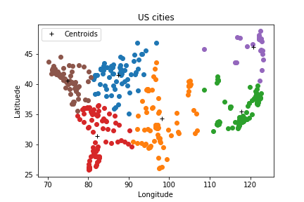
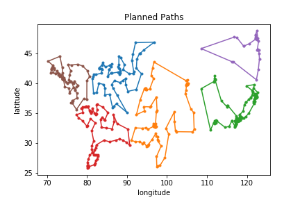

# parallel-genetic-algorithm-UAV-path-planning

UAV (Unmanned Aerial Vehicle) path planning using the Genetic Algorithm parallelized with CUDA.
Search for the shortest path for a UAV to fly pass all selected cities in a real region of US.
Implementation is based on [this paper](https://dl.acm.org/citation.cfm?id=2931679).

### How to use
1. Make sure [Numba](https://numba.pydata.org) is installed. We use version 0.42.0.
2. Download the [United States Cities Database](https://simplemaps.com/data/us-cities) and put it in folder **"data/"**.
3. Run main.py to get the results shown below.

### Results

Problem Setting: 6 UAVs should fly pass all US cities with population more than 100k.

The K-means clustering result:

  

The planned paths for all UAVs:

  

